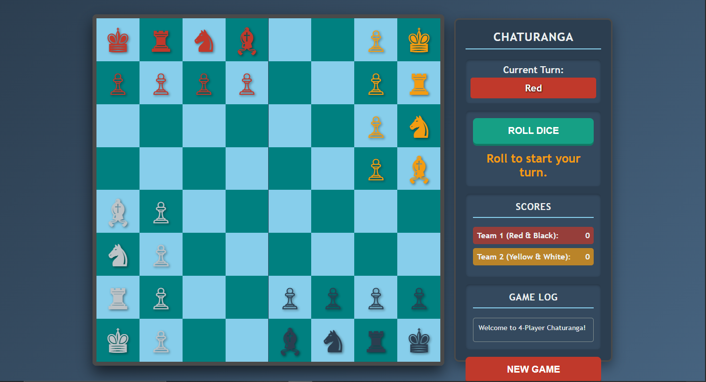

<!-- HEADER BANNER -->

  
    
  
  
  

<h1 align="center">♟️ Chaturanga – Advanced 4-Player Ancient Chess</h1>

  An interactive, modern remake of the legendary <b>Chaturanga</b> — the original ancestor of modern chess. 
  Built entirely with <b>HTML</b>, <b>CSS</b>, and <b>Vanilla JavaScript</b>.

<!-- FEATURES SECTION -->
<h2>🔥 Highlights</h2>

<table>
  <tr>
    <td><b>🎮 Full 4-Player Gameplay</b></td>
    <td><b>🎲 Dice-Based Movement</b></td>
  </tr>
  <tr>
    <td>Red, Yellow, Black, White players with team alliances.</td>
    <td>Rolls (2–5) determine which piece type can move.</td>
  </tr>

  <tr>
    <td><b>💡 Smart Move Highlighting</b></td>
    <td><b>📜 Detailed Game Log</b></td>
  </tr>
  <tr>
    <td>Animated indicators for valid moves, with selection glow.</td>
    <td>Every action is logged — rolls, captures, promotions, moves.</td>
  </tr>

  <tr>
    <td><b>🔄 Full Turn Management</b></td>
    <td><b>🏆 Dynamic Scoring System</b></td>
  </tr>
  <tr>
    <td>Auto rotation across 4 players with skip-if-no-move logic.</td>
    <td>Teams score points based on captured pieces.</td>
  </tr>

  <tr>
    <td><b>🖥️ Modern Responsive UI</b></td>
    <td><b>📦 Zero Dependencies</b></td>
  </tr>
  <tr>
    <td>Custom layout, glowing panels, smooth hover effects.</td>
    <td>No frameworks, runs in a single HTML file.</td>
  </tr>
</table>

<!-- PREVIEW IMAGE -->
<h2>📸 Preview</h2>

  

<!-- DEMO LINK -->
<h2>🌐 Live Demo (GitHub Pages)</h2>

Once deployed, your game will be available at:

  

<!-- TECH STACK -->
<h2>🛠️ Tech Stack</h2>

<ul>
  <li><b>HTML5</b> – Main structure</li>
  <li><b>CSS3</b> – UI, layout, animations, responsive system</li>
  <li><b>JavaScript</b> – Entire game engine</li>
</ul>

<!-- PROJECT STRUCTURE -->
<h2>📁 Project Structure</h2>

<pre>
/chaturanga
│
└── index.html          # Entire game (HTML + CSS + JS)
</pre>

<!-- HOW TO RUN -->
<h2>▶️ How to Run</h2>

<ol>
  <li>Download or clone this repository</li>
  <li>Open <code>index.html</code> in any browser</li>
</ol>

No installation. No dependencies. Everything is contained in one file.

<!-- GAMEPLAY DETAILS -->
<h2>♟️ Gameplay Rules</h2>

<ul>
  <li>Pawns move differently depending on their side (North/East/South/West)</li>
  <li>Kings move one step in any direction</li>
  <li>Boats jump diagonally (like elephants in Indian Chess)</li>
  <li>Horses use L-shaped knight movement</li>
  <li>Elephants move like rooks</li>
  <li>Pawns promote to Boats on reaching the opposite end</li>
  <li>A team loses when both their Kings are gone</li>
</ul>

<!-- FUTURE PLANS -->
<h2>🚧 Future Enhancements</h2>

<ul>
  <li>Online multiplayer mode</li>
  <li>AI bots with difficulty levels</li>
  <li>Sound effects & animations</li>
  <li>Theme selector (Classic / Modern / Dark)</li>
  <li>Save/Load system using LocalStorage</li>
</ul>

<!-- CONTRIBUTING -->
<h2>🤝 Contributing</h2>

Contributions are welcome! Fork this repo and submit a pull request for improvements.

<!-- LICENSE -->
<h2>📜 License</h2>

  Licensed under the <b>MIT License</b> — free to use, modify, and distribute.

<!-- FOOTER -->

  <b>Made with ♟️ strategy and passion.</b> 
  <i>Enjoy the game!</i>

